Data Science su attacchi di squali
================
Mejric Maroan

## Obiettivo
-   Andamento degli attacchi per anno
-   Come cambiano gli attacchi in base al paese
-   Chi viene colpito maggiormente da questi attacchi
-   Caratteristiche degli squali più pericolosi

## Dataset
Il dataset è stato preso da 'kaggle.com' e contiene dati presi dal sito 'sharkattackfile.net'

<!-- -->

## Andamento degli attacchi in base all'anno
### Numero attacchi per anno (1980-2017)

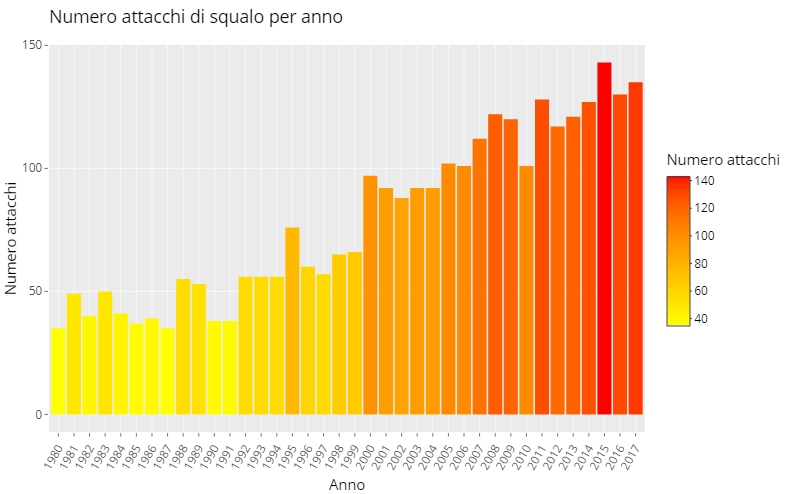<!-- -->

### Fatalità degli attacchi per anno (1980-2017)

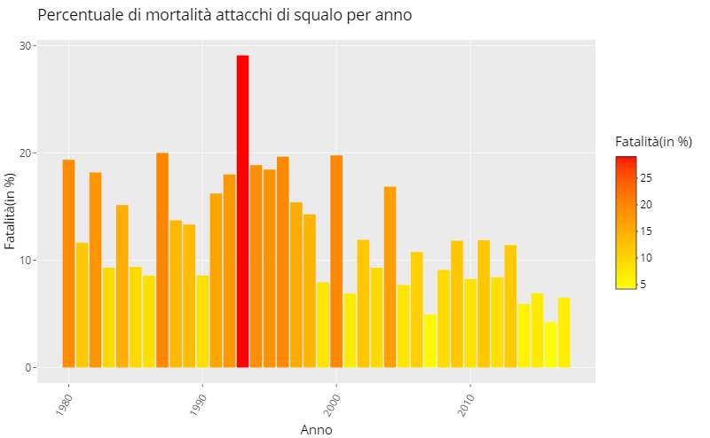<!-- -->

## Mortalità totale (1980-2017)

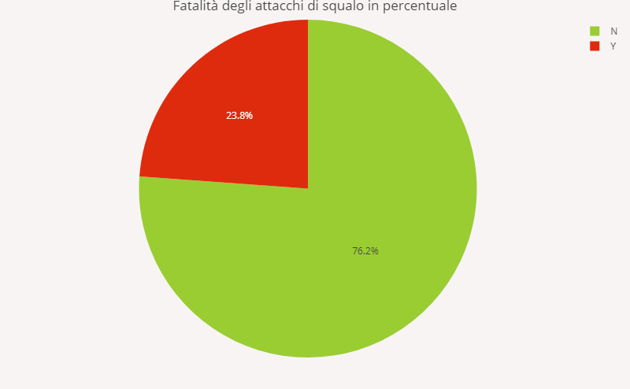<!-- -->

## Attacchi suddivisi per paese/area
### Numero di attacchi per paese 

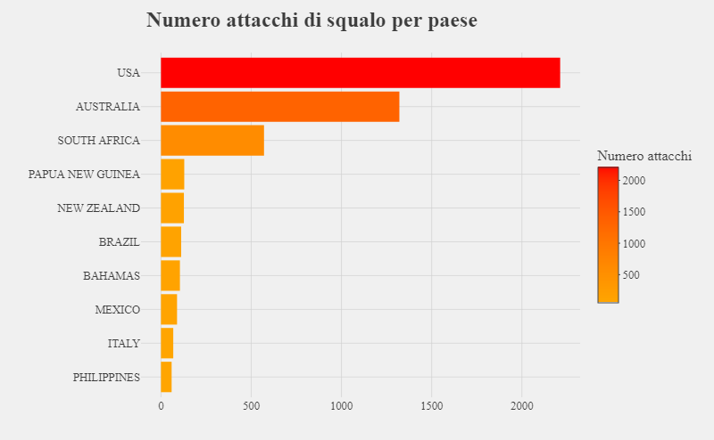<!-- -->

### Numero di attacchi fatali e non per paese 

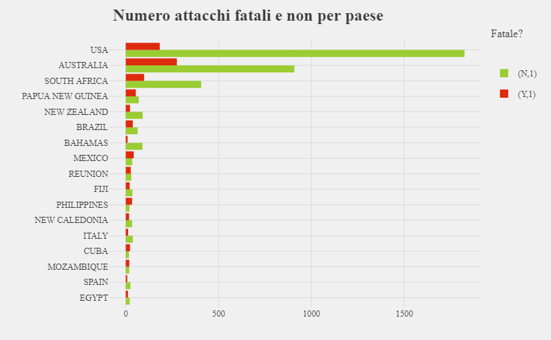<!-- -->

### Probabilità di morire a casusa di un attacco per paese

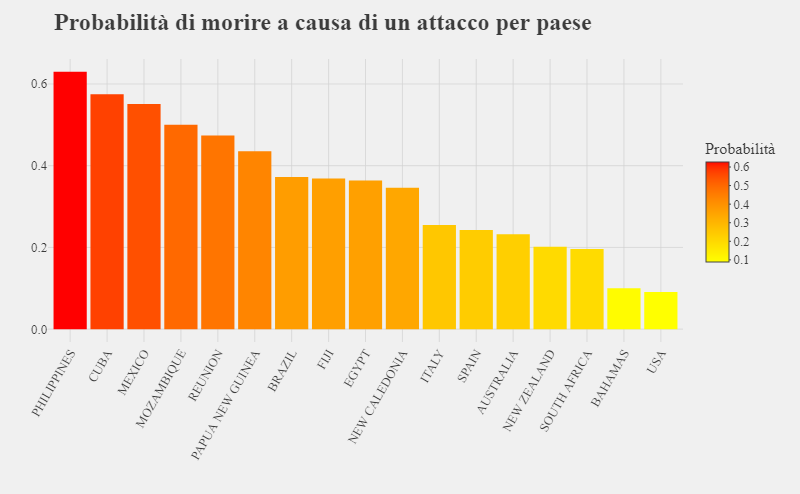<!-- -->

### Probabilità di sopravvivere ad un attacco per paese 

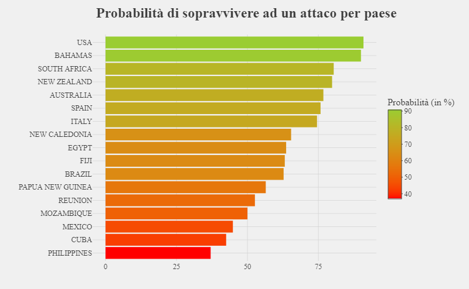<!-- -->

### Numero di attacchi fatali e non per area

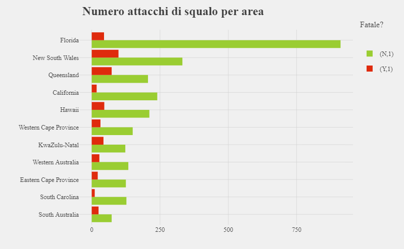<!-- -->

## Chi e quando è stato attaccato
### Numero di attacchi suddivisi per età 

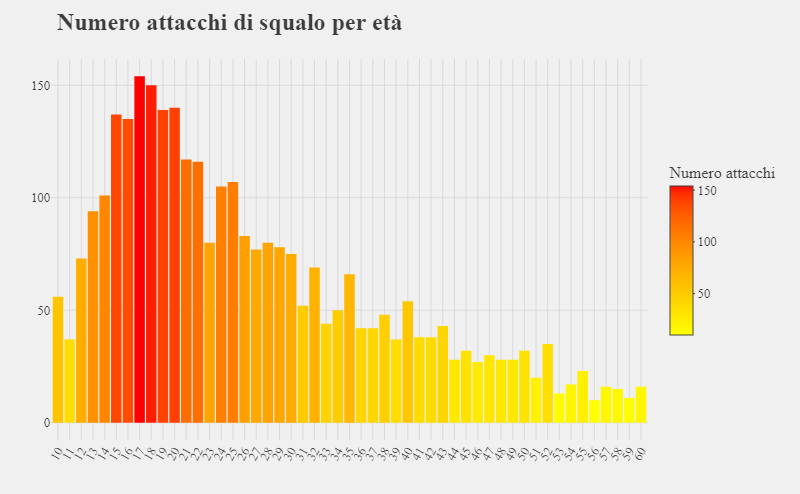<!-- -->

### Numero di attacchi fatali e non per attività

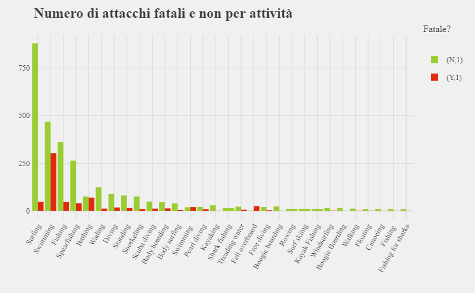<!-- -->

### Fatalità degli attacchi di squalo per attività

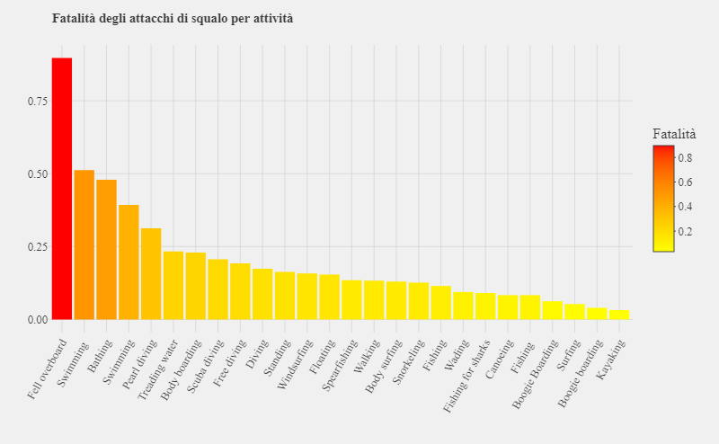<!-- -->

### Numero attacchi per attività e conseguenza

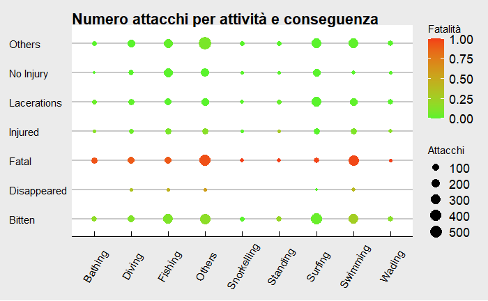<!-- -->

### Numero attacchi per ora

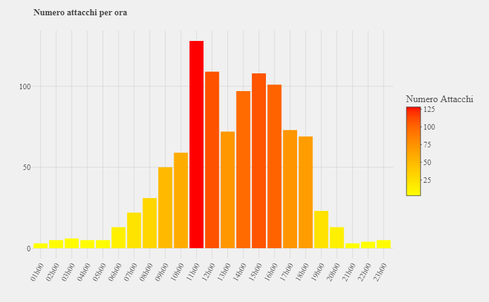<!-- -->

## Attacchi suddivisa per dimensioni e specie dello squalo
### Numero di attacchi per dimensione dello squalo

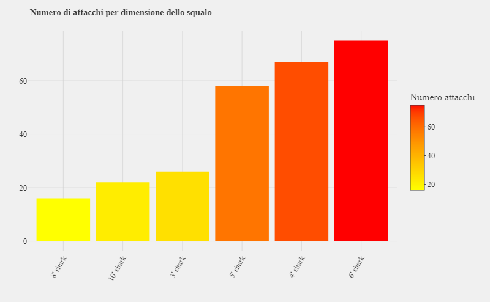<!-- -->

### Fatalità degli attacchi di squalo per dimensione

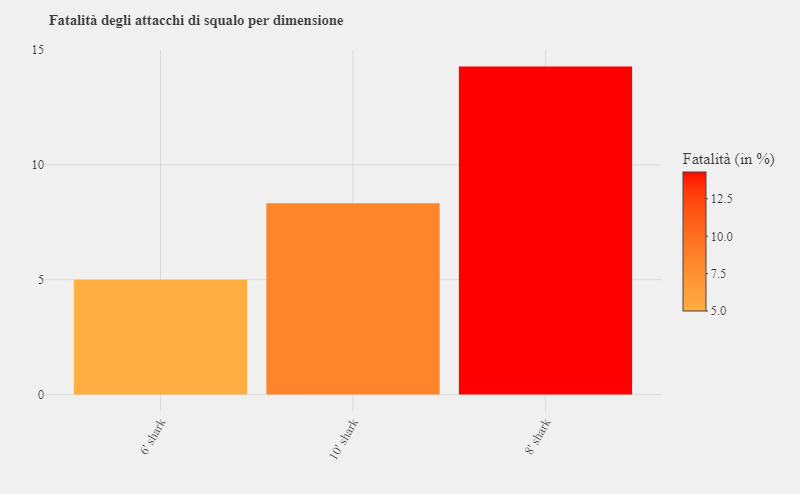<!-- -->

### Numero di attacchi per dimensione dello specie

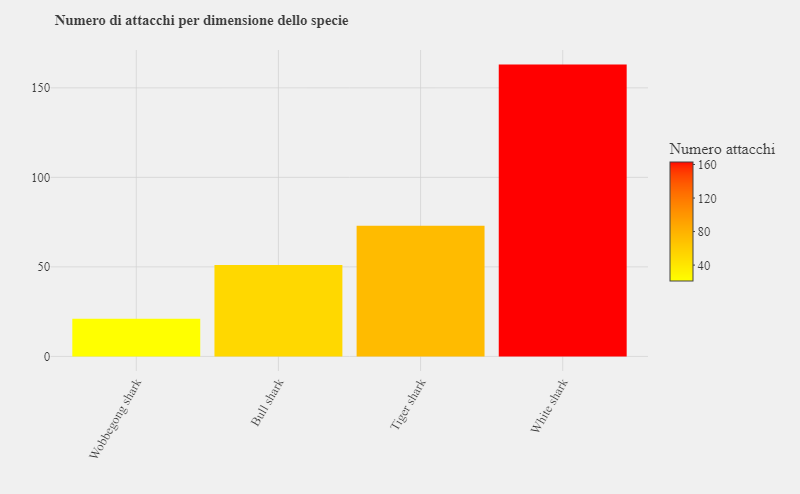<!-- -->

### Fatalità degli attacchi di squalo per specie

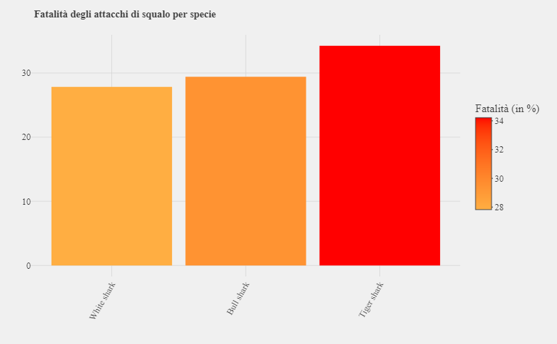<!-- -->

## Conclusioni

Vedendo questi grafici possiamo concludere che il numero di attacchi ha avuto un 
andamento crescente nel tempo, mentre la mortalità non ha un'andamento preciso ma 
negli ultimi anni si sta mantenendo più bassa del solito.  
Possiamo inoltre notare che i paesi bagnati dagli oceani sono soggetti a più attacchi 
di squalo, questo perchè in quei paesi sono popolari molti sport acquatici come il surf per esempio.
Su questi prevalgono, Stati Uniti, Australia e Sudafrica che sorprendentemente nonostante il 
grande numero di attacchi, sono tra i paesi con la mortalità in caso di attacchi più bassa, e ciò
mi porta a pensare che data la frequenza degli attacchi in quelle zone, le persone li sono più 
preparate a come comportarsi in caso di attacco di squalo. 
Andando poi a vedere le attività che stavano svolgendo le vittime, possiamo notare che le attività 
che provocano il maggior numero di attacchi sono surf, nuoto e pesca.
Ma che di nuovo (nuoto a parte) sono tra le attività con mortalità più bassa.
Questo probabilmente perchè hanno le tavole da surf o le barche che fanno da scudo.
Mentre il cadere da una nave, è si meno frequente ma provoca tante morti (fatalità più alta).  
Infine analizzando le tipologie di squali, sono giunto a concludere che gli squali bianchi sono
i più aggressivi mentre gli squali tigre sono i più pericolosi (fatalità maggiore).
